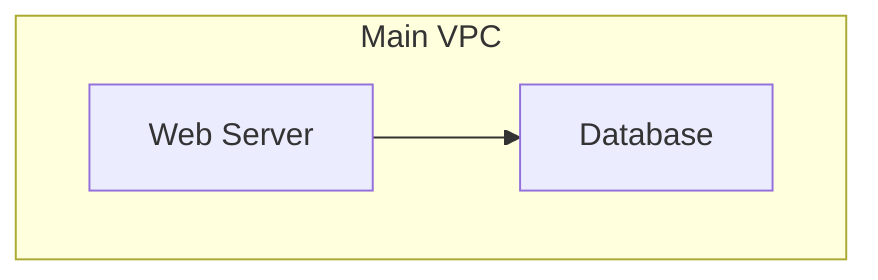

# 🎨 Cloud Architecture Visualization Guide

**Complete guide to visualizing your cloud architectures with @cloud-diagrams**

This guide covers all the ways you can visualize, render, and share your cloud architecture diagrams created with the `@cloud-diagrams` library.

## 🚀 Quick Visualization at localhost:3000

### 1. Web Viewer (Instant Visualization)

**The fastest way to see your architectures in action:**

```bash
# Navigate to the web viewer
cd cloud-diagrams-ts/examples/web-viewer

# Start the server
node server.js

# Open browser at http://localhost:3000
```

**What you get:**

- 🎨 Interactive diagrams with professional styling
- 🔄 Real-time rendering with Mermaid.js
- 📱 Responsive design for all devices
- 📥 SVG export functionality
- 🎯 Multiple architecture examples
- 🌙 Theme switching (Light/Dark/Forest/Base)

### 2. React Development Server

**For React applications with hot reload:**

```bash
# Create a new React app (if needed)
npx create-react-app my-architecture-app --template typescript
cd my-architecture-app

# Install dependencies
npm install @cloud-diagrams/core @cloud-diagrams/aws @cloud-diagrams/react

# Replace src/App.tsx with your diagram code
# (See React examples below)

# Start development server
npm start

# Opens automatically at http://localhost:3000
```

## 📋 Visualization Methods

### Method 1: Direct Mermaid Output

**Best for:** Quick prototyping, sharing code, documentation

```typescript
import { Diagram } from '@cloud-diagrams/core';
import { EC2, RDS, VPC } from '@cloud-diagrams/aws';

const diagram = new Diagram('My Architecture');
const vpc = new VPC('main-vpc', { label: 'Main VPC' });
const web = new EC2('web', { label: 'Web Server' });
const db = new RDS('db', { label: 'Database' });

vpc.addNode(web);
vpc.addNode(db);
diagram.addGroup(vpc);
diagram.connect(web, db);

// Get Mermaid code
const mermaidCode = diagram.render();
console.log(mermaidCode);

// Copy output to any Mermaid viewer:
// - GitHub markdown
// - Mermaid Live Editor (mermaid.live)
// - VS Code Mermaid Preview
// - Notion, GitLab, etc.
```

### Method 2: React Components

**Best for:** Web applications, interactive dashboards, user interfaces

```tsx
import React from 'react';
import { DiagramRenderer, DiagramProvider } from '@cloud-diagrams/react';
import { Diagram } from '@cloud-diagrams/core';
import { EC2, RDS } from '@cloud-diagrams/aws';

function createMyArchitecture() {
  const diagram = new Diagram('My AWS Architecture');
  const web = new EC2('web', {
    label: 'Web Server',
    instanceType: 't3.medium',
  });
  const db = new RDS('db', {
    label: 'PostgreSQL',
    engine: 'postgres',
  });

  diagram.addNode(web);
  diagram.addNode(db);
  diagram.connect(web, db);

  return diagram;
}

function App() {
  const diagram = createMyArchitecture();

  return (
    <DiagramProvider>
      <div style={{ padding: '20px' }}>
        <h1>My Cloud Architecture</h1>
        <DiagramRenderer
          diagram={diagram}
          theme="default"
          width={1000}
          height={600}
          onNodeClick={(nodeId) => {
            console.log(`Clicked: ${nodeId}`);
            // Handle node interactions
          }}
        />
      </div>
    </DiagramProvider>
  );
}

export default App;
```

### Method 3: CLI Generation

**Best for:** CI/CD pipelines, batch processing, automation

```bash
# Install CLI globally
npm install -g @cloud-diagrams/cli

# Generate from TypeScript file
cloud-diagrams generate my-architecture.ts -o architecture.svg

# Generate with custom dimensions
cloud-diagrams generate my-architecture.ts -f png -o diagram.png --width 1920 --height 1080

# Generate PDF for presentations
cloud-diagrams generate my-architecture.ts -f pdf -o presentation.pdf

# Watch mode for development
cloud-diagrams generate my-architecture.ts --watch --output diagram.svg
```

### Method 4: Programmatic Export

**Best for:** Custom applications, automated reporting, integration

```typescript
import { Diagram, exportDiagram } from '@cloud-diagrams/core';
import { EC2, RDS } from '@cloud-diagrams/aws';

async function generateAndExport() {
  const diagram = new Diagram('Generated Architecture');

  // Build your diagram
  const web = new EC2('web');
  const db = new RDS('db');
  diagram.addNode(web);
  diagram.addNode(db);
  diagram.connect(web, db);

  try {
    // Export to different formats
    const svgContent = await exportDiagram(diagram, 'svg', {
      theme: 'default',
      width: 800,
      height: 600,
    });

    const pngDataUrl = await exportDiagram(diagram, 'png', {
      width: 1920,
      height: 1080,
      quality: 0.9,
    });

    const pdfBuffer = await exportDiagram(diagram, 'pdf', {
      title: 'Architecture Diagram',
      author: 'Cloud Architect',
    });

    // Save or use the exported content
    console.log('✅ Diagrams exported successfully');
  } catch (error) {
    console.error('❌ Export failed:', error);
  }
}
```

## 🌐 Online Visualization Platforms

### 1. Mermaid Live Editor

**Perfect for quick sharing and testing:**

1. Go to [mermaid.live](https://mermaid.live)
2. Paste your generated Mermaid code
3. View instantly with different themes
4. Share links with colleagues
5. Export to SVG/PNG

### 2. GitHub Markdown

**For documentation and wikis:**

````markdown
# My Architecture


````

- Renders automatically in GitHub
- Works in issue comments and pull requests
- Perfect for architecture documentation

````

### 3. VS Code Preview

**For development workflow:**

1. Install "Mermaid Markdown Syntax Highlighting" extension
2. Create a `.md` file with your Mermaid code
3. Use Ctrl+Shift+V to preview
4. Live updates as you edit

### 4. Notion, GitLab, Confluence

Most modern platforms support Mermaid diagrams directly in their markdown.

## 🎨 Customization Options

### Theme Configuration

```typescript
// Built-in themes
diagram.setTheme('default'); // Professional light
diagram.setTheme('dark');    // Dark mode
diagram.setTheme('forest');  // Green theme
diagram.setTheme('base');    // Minimal

// Custom theme
diagram.setTheme({
  name: 'corporate',
  background: '#f8f9fa',
  nodeDefaults: {
    fillColor: '#ffffff',
    strokeColor: '#007bff',
    strokeWidth: 2,
    fontFamily: 'Arial, sans-serif',
  },
  edgeDefaults: {
    strokeColor: '#6c757d',
    strokeWidth: 1,
  },
  groupDefaults: {
    background: '#e9ecef',
    border: '1px solid #dee2e6',
  },
});
````

### Layout Algorithms

```typescript
import { LayoutAlgorithm } from '@cloud-diagrams/core';

// Automatic hierarchical layout
diagram.setLayout(LayoutAlgorithm.HIERARCHICAL, {
  direction: 'TOP_TO_BOTTOM',
  nodeSpacing: 50,
  levelSpacing: 100,
});

// Manual positioning for precise control
diagram.setLayout(LayoutAlgorithm.MANUAL);
webServer.setPosition(100, 100);
database.setPosition(300, 100);
```

### Interactive Features

```typescript
// Click handlers
webServer.onClick((node, event) => {
  console.log(`Clicked: ${node.metadata.label}`);
  // Open AWS console, show details, etc.
  window.open(
    `https://console.aws.amazon.com/ec2/v2/home#Instances:instanceId=${node.id}`
  );
});

// Hover effects
database.onHover((node, event) => {
  // Show tooltip, highlight connections
  showTooltip(`Database: ${node.metadata.engine}`);
});

// Global events
diagram.onNodeAdded((node) => {
  console.log(`Node added: ${node.id}`);
});
```

## 💼 Enterprise Integration

### 1. Corporate Documentation

```typescript
// Generate diagrams for architecture documentation
async function generateDocumentation() {
  const diagrams = [
    createProductionArchitecture(),
    createStagingArchitecture(),
    createDevelopmentArchitecture(),
  ];

  for (const diagram of diagrams) {
    const svg = await exportDiagram(diagram, 'svg', {
      theme: 'corporate',
      title: diagram.getTitle(),
    });

    // Save to documentation system
    await saveToWiki(diagram.getTitle(), svg);
  }
}
```

### 2. CI/CD Pipeline Integration

```yaml
# GitHub Actions example
name: Generate Architecture Diagrams

on:
  push:
    paths: ['src/architecture/**']

jobs:
  generate-diagrams:
    runs-on: ubuntu-latest
    steps:
      - uses: actions/checkout@v3

      - name: Setup Node.js
        uses: actions/setup-node@v3
        with:
          node-version: '18'

      - name: Install dependencies
        run: npm install -g @cloud-diagrams/cli

      - name: Generate diagrams
        run: |
          cloud-diagrams generate src/architecture/production.ts -o docs/production.svg
          cloud-diagrams generate src/architecture/production.ts -f png -o docs/production.png

      - name: Commit diagrams
        run: |
          git add docs/
          git commit -m "Update architecture diagrams"
          git push
```

### 3. Custom Web Applications

```typescript
// Integration with existing web apps
class ArchitectureViewer {
  private container: HTMLElement;
  private diagram: Diagram;

  constructor(containerId: string, architectureData: any) {
    this.container = document.getElementById(containerId)!;
    this.diagram = this.buildDiagramFromData(architectureData);
    this.render();
  }

  private async render() {
    const mermaidCode = this.diagram.render();
    const { svg } = await mermaid.render('diagram-' + Date.now(), mermaidCode);
    this.container.innerHTML = svg;

    // Add custom interactions
    this.addEventListeners();
  }

  private addEventListeners() {
    this.container.querySelectorAll('g.node').forEach((node) => {
      node.addEventListener('click', this.handleNodeClick.bind(this));
    });
  }

  public updateArchitecture(newData: any) {
    this.diagram = this.buildDiagramFromData(newData);
    this.render();
  }
}

// Usage
const viewer = new ArchitectureViewer('diagram-container', architectureData);
```

## 📱 Mobile and Responsive Viewing

### Responsive Design Tips

```css
/* Make diagrams responsive */
.diagram-container {
  width: 100%;
  max-width: 100%;
  overflow-x: auto;
}

.diagram-container svg {
  max-width: 100%;
  height: auto;
}

/* Mobile-specific adjustments */
@media (max-width: 768px) {
  .diagram-container {
    padding: 10px;
  }

  /* Smaller font sizes for mobile */
  .node text {
    font-size: 12px;
  }
}
```

### Touch-Friendly Controls

```typescript
// Touch support for mobile devices
diagram.enableTouchGestures({
  pan: true,
  zoom: true,
  tap: true,
});

// Mobile-optimized click handlers
node.onClick((node, event) => {
  // Show mobile-friendly modal instead of popup
  showMobileModal(node.metadata);
});
```

## 🎯 Best Practices for Visualization

### 1. **Optimize for Your Audience**

```typescript
// For technical teams
diagram.setTheme('dark');
diagram.showMetadata(true);
diagram.enableAdvancedFeatures(true);

// For business stakeholders
diagram.setTheme('default');
diagram.simplifyLabels(true);
diagram.hideImplementationDetails(true);

// For documentation
diagram.setTheme('corporate');
diagram.addLegend(true);
diagram.includeTitle(true);
```

### 2. **Performance Optimization**

```typescript
// For large diagrams (100+ nodes)
diagram.setLayout(LayoutAlgorithm.MANUAL);
diagram.enableVirtualization(true);
diagram.setRenderBatchSize(50);

// Memory management
diagram.enableAutoCleanup(true);
diagram.setMaxHistory(10);
```

### 3. **Accessibility**

```typescript
// Screen reader support
diagram.enableAccessibility(true);
diagram.addAriaLabels(true);

// High contrast mode
diagram.setTheme('high-contrast');

// Keyboard navigation
diagram.enableKeyboardNavigation(true);
```

## 🚀 Getting Started Checklist

**For immediate visualization:**

- [ ] Navigate to `examples/web-viewer/`
- [ ] Run `node server.js`
- [ ] Open `http://localhost:3000`
- [ ] Explore the interactive examples

**For custom diagrams:**

- [ ] Install `@cloud-diagrams/core` and provider packages
- [ ] Create your diagram with TypeScript
- [ ] Use one of the visualization methods above
- [ ] Customize themes and layouts as needed

**For production use:**

- [ ] Set up React components or CLI workflows
- [ ] Integrate with your documentation system
- [ ] Configure CI/CD for automated diagram generation
- [ ] Train team on the visualization tools

## 📞 Need Help?

- **Quick Demo**: Use the web viewer at localhost:3000
- **Documentation**: Check [TUTORIAL.md](./TUTORIAL.md)
- **Examples**: Explore [examples/](./examples/)
- **GitHub Issues**: Report problems or request features
- **Discussions**: Ask questions and share your architectures

---

**Start visualizing your cloud architectures today! 🎨**
