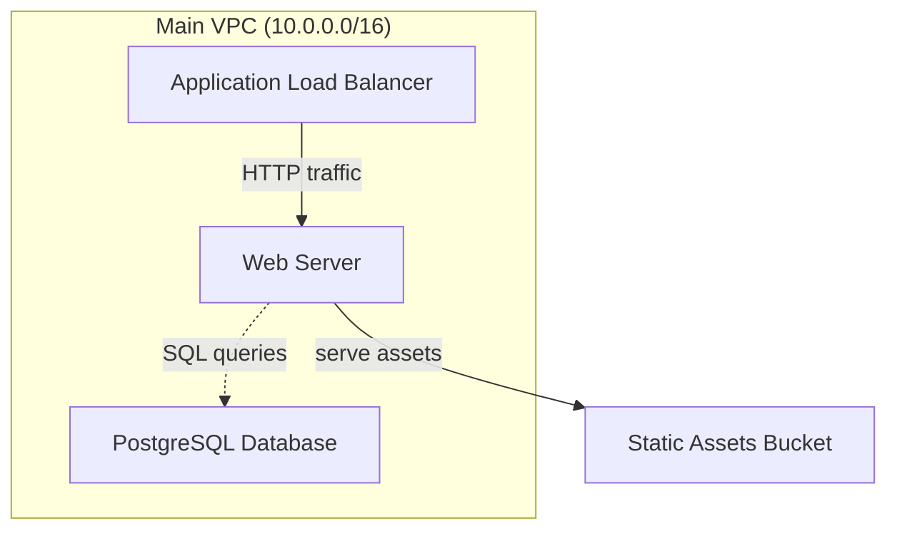

# 🚀 Quick Start Example

This example shows how to create your first cloud architecture diagram using @cloud-diagrams.

## Installation

```bash
# Install the required packages
npm install @cloud-diagrams/core @cloud-diagrams/aws
```

## Basic Example

```typescript
// basic-architecture.ts
import { Diagram, Group } from '@cloud-diagrams/core';
import { EC2, RDS, VPC, LoadBalancer, S3 } from '@cloud-diagrams/aws';

// Create a new diagram
const diagram = new Diagram('My First AWS Architecture');

// Create a VPC group to organize resources
const vpc = new Group('main-vpc', {
  label: 'Main VPC (10.0.0.0/16)',
  style: {
    background: '#e8f4f8',
    border: '2px solid #1f77b4',
    borderRadius: '8px',
  },
});

// Create cloud resources
const loadBalancer = new LoadBalancer('alb', {
  label: 'Application Load Balancer',
});

const webServer = new EC2('web-server', {
  label: 'Web Server',
  instanceType: 't3.medium',
  availabilityZone: 'us-east-1a',
});

const database = new RDS('database', {
  label: 'PostgreSQL Database',
  engine: 'postgres',
  instanceClass: 'db.t3.micro',
});

const storage = new S3('static-assets', {
  label: 'Static Assets Bucket',
});

// Organize resources in the VPC
vpc.addNode(loadBalancer);
vpc.addNode(webServer);
vpc.addNode(database);

// Add VPC to diagram
diagram.addGroup(vpc);

// S3 is outside VPC
diagram.addNode(storage);

// Connect the components
diagram.connect(loadBalancer, webServer, {
  label: 'HTTP traffic',
});

diagram.connect(webServer, database, {
  label: 'SQL queries',
  style: { strokeDasharray: '5,5' },
});

diagram.connect(webServer, storage, {
  label: 'serve assets',
});

// Generate the diagram
console.log('=== Generated Mermaid Diagram ===');
console.log(diagram.render());

// Display diagram statistics
console.log('\n=== Diagram Statistics ===');
console.log(`Nodes: ${diagram.getNodes().length}`);
console.log(`Groups: ${diagram.getGroups().length}`);
console.log(`Connections: ${diagram.getConnections().length}`);

// List all resources
console.log('\n=== Resources ===');
diagram.getNodes().forEach((node) => {
  console.log(`- ${node.metadata.label || node.id} (${node.iconType})`);
});
```

## Running the Example

1. **Create the file**: Save the code above as `basic-architecture.ts`

2. **Run with TypeScript**:

   ```bash
   npx ts-node basic-architecture.ts
   ```

3. **Or compile and run**:
   ```bash
   npx tsc basic-architecture.ts
   node basic-architecture.js
   ```

## Expected Output

The script will output:

1. **Mermaid diagram code** that you can paste into any Mermaid viewer
2. **Statistics** about your diagram
3. **Resource list** showing all components

### Sample Mermaid Output



## Next Steps

1. **Try the CLI**: Install `@cloud-diagrams/cli` globally and use templates
2. **Add React**: Install `@cloud-diagrams/react` for interactive diagrams
3. **Explore Multi-Cloud**: Try Azure and GCP services
4. **Read the Tutorial**: Check out [TUTORIAL.md](../../TUTORIAL.md) for comprehensive examples

## Customization

You can customize the diagram by:

- **Changing themes**: `diagram.setTheme('dark')`
- **Using different layouts**: `diagram.setLayout('hierarchical')`
- **Adding more metadata**: Include descriptions, tags, and custom properties
- **Styling connections**: Custom colors, dash patterns, and labels

## Need Help?

- 📚 [Complete Tutorial](../../TUTORIAL.md)
- 🤝 [Contributing Guide](../../CONTRIBUTING.md)
- 🐛 [Report Issues](https://github.com/amaboh/kloud_diagramming/issues)
- 💬 [Ask Questions](https://github.com/amaboh/kloud_diagramming/discussions)
